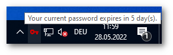
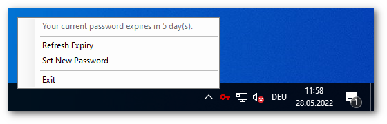
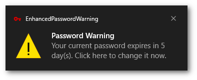
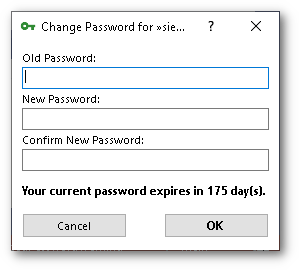

# Enhanced Password Warning
Inform domain users about their password expiry on (offline) Windows workstations.

## But Why?
Windows already offers a group policy called `Interactive Logon: Prompt user to change password before expiration`, but it is implemented poorly: it only works if the computer has connection to the domain controller when logging in.

This totally neglects mobile workstations (i.e. notebooks) which are used on the way and at home. For these cases, EnhancedPasswordWarning provides a solution by caching the "pwdLastSet" and "maxPwdAge" LDAP attributes locally. This enables the program to display a warning (as desktop notification) even if the workstation is offline.

In addition to that, it provides a simple form for changing the password (which of course then needs a connection to the domain controller, e.g. via VPN).

It is based on the idea of [LdapPwd-Desklet](https://github.com/schorschii/LdapPwd-Desklet) for Linux.

It is currently translated into English and German. I'm happy about pull requests for further translation or other improvements!

## Screenshots





## Installation
### Setup
You can use the setup file on the latest Github release page.

### Manually
Copy the program with its libraries into the Program Files folder and create a shortcut in the all users autostart folder.

### Configuration
You can define the limit when the program should display a warning in the configuration file `EnhancedPasswordWarning.ini`.
```
[EnhancedPasswordWarning]
warnDays=14
```
